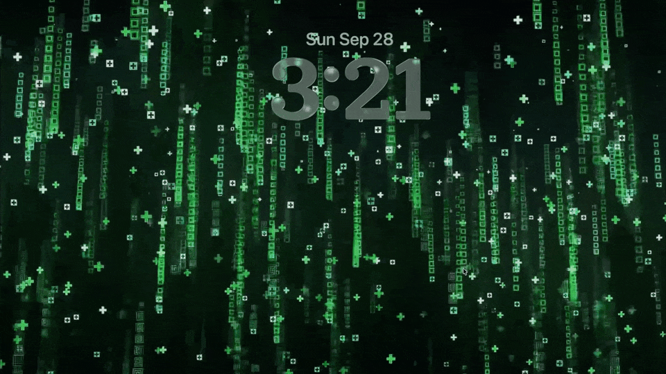
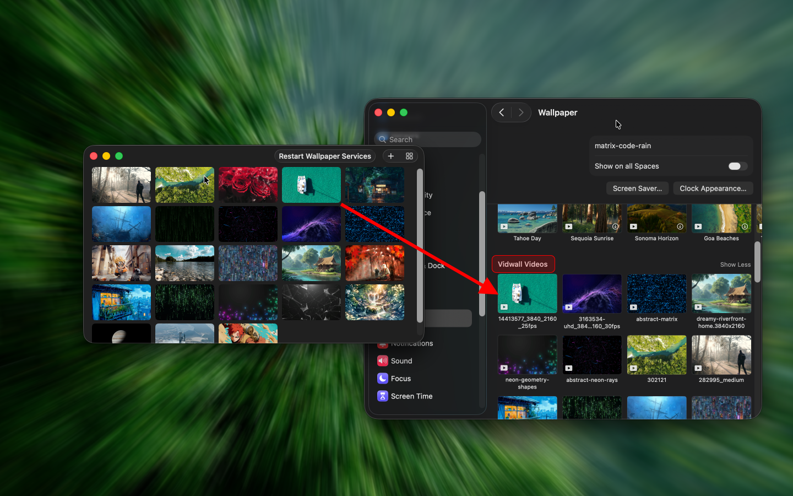

<!--idoc:ignore:start-->
> [!TIP]
> Declaration: This project is not an open-source project. The repository serves as the official website, used to collect issues and user demands. This is done to save costs, because without an official website, the application cannot pass the review.
<!--idoc:ignore:end-->

<div align="center">
  <br />
  <br />
  
  <h1>
    Vidwall Hub
  </h1>
  <!--rehype:style=border: 0;-->
  <p>
    <a href="./README.zh.md">简体中文</a> • 
    <a href="https://wangchujiang.com/vidwall/" target="_blank">Vidwall</a> • 
    <a target="_blank" href="https://github.com/jaywcjlove/vidwall-hub/issues/new?template=bug_report.yml">Contact & Support</a> • 
    <a href="./CHANGELOG.md">Changelog</a>
  </p>
  <p>
    <a target="_blank" href="https://github.com/jaywcjlove/vidwall-hub/releases/latest/" title="Vidwall Hub for macOS">
      
    </a>
  </p>
</div>
<div align="center">

minimum OS requirement: `macOS Tahoe 26+`

</div>





**Vidwall Hub** is a tool that allows you to easily import videos (mp4, mov) into the system wallpaper service and use them as lock screen animations in **System Settings**.

When trying to implement both dynamic wallpapers and dynamic lock screens through the [Vidwall](https://github.com/jaywcjlove/vidwall) app, this feature could not be realized due to macOS sandbox restrictions. Therefore, I created a standalone version of the tested code and provide it for free, as a complement to [Vidwall](https://github.com/jaywcjlove/vidwall). Even when running independently and bypassing the sandbox, it still cannot directly set dynamic lock screens because macOS does not provide the related API. Vidwall Hub only imports videos into the system wallpaper service, and users need to complete the final application in the wallpaper options in System Settings.

### URL Scheme

**Vidwall Hub** allows activating the tool via URL and automatically importing a video based on the file path parameter in the URL.

```bash
vidwallhub://open?file=/file/to/path/video.mp4
```

### Lock Screen (macOS 26+)

Based on the current implementation, the lock screen import workflow of Vidwall Hub is as follows (user-level, no administrator privileges required):

1. **Load system manifest**: Read `~/Library/Application Support/com.apple.wallpaper/aerials/manifest/entries.json`.
2. **Create Vidwall category (first time)**: If the Vidwall category does not exist, create a `Vidwall Videos` category and its subcategory.
3. **Generate asset entries**: Create an `asset` entry for each imported video and write it into `entries.json`.
4. **Write thumbnails**: Generate a PNG thumbnail from the first frame of the video and save it to `~/Library/Application Support/com.apple.wallpaper/aerials/thumbnails/<UUID>.png`.
5. **Write video files**:
   - `.mov`: Copy to `~/Library/Application Support/com.apple.wallpaper/aerials/videos/<UUID>.mov`
   - `.mp4`: Export to `.mov` using `AVAssetExportPresetPassthrough`, then write to the directory above
6. **Refresh wallpaper services**: Run  
   `killall Wallpaper WallpaperAgent WallpaperAerialsExtension WallpaperImageExtension WallpaperLegacyExtension`  
   to force the system to reload the resources immediately.

**Resource usage notes:**

- The import process incurs one-time file read/write operations and (for `.mp4` only) container remuxing overhead.
- After import is complete, playback is handled by the system wallpaper-related processes. Vidwall Hub does not participate in rendering and does not continuously consume additional CPU or GPU resources.
- The application's responsibility is limited to managing `entries.json` and the associated media files (videos/thumbnails), including importing, updating, and deleting them.

**macOS 15 is not supported yet**

```
/Library/Application Support/com.apple.idleassetsd/Customer/4KSDR240FPS
/Library/Application Support/com.apple.idleassetsd/Customer/entries.json
```