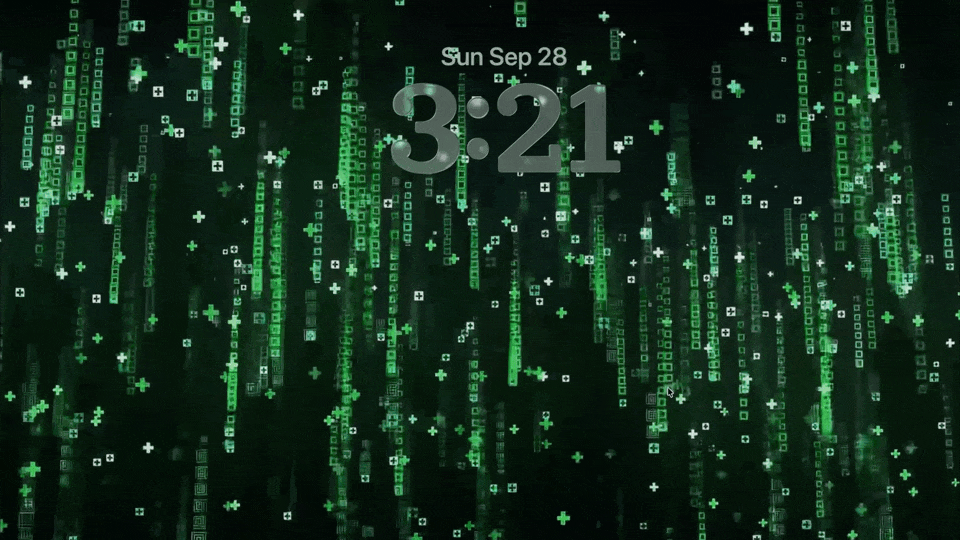
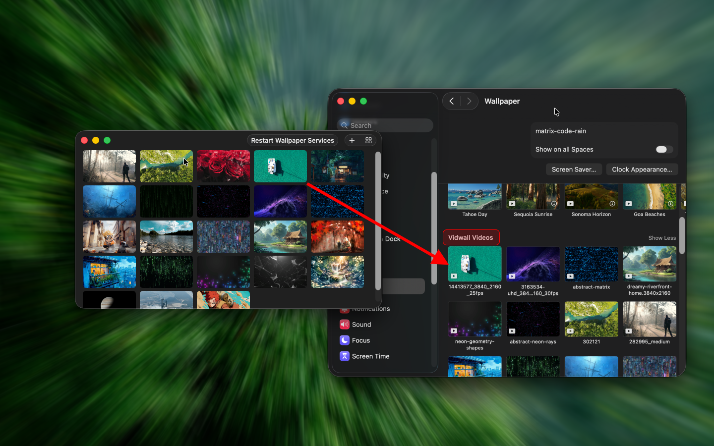

<!--idoc:ignore:start-->
> [!TIP]
> Declaration: This project is not an open-source project. The repository serves as the official website, used to collect issues and user demands. This is done to save costs, because without an official website, the application cannot pass the review.
<!--idoc:ignore:end-->

<div align="center">
  <br />
  <br />
  
  <h1>
    Vidwall Hub
  </h1>
  <!--rehype:style=border: 0;-->
  <p>
    <a href="https://github.com/jaywcjlove/vidwall-hub/releases">
      
    </a>
    <a href="https://github.com/jaywcjlove/vidwall-hub/releases/latest/">
      
    </a>
    <a href="#brew-install">
      
    </a>
    
  </p>
  <p>
    <a href="./README.zh.md">简体中文</a> • 
    <a href="https://wangchujiang.com/vidwall/" target="_blank">Vidwall</a> • 
    <a target="_blank" href="https://github.com/jaywcjlove/vidwall-hub/issues/new?template=bug_report.yml">Contact & Support</a> • 
    <a href="./CHANGELOG.md">Changelog</a>
  </p>
  <p>
    <a target="_blank" href="https://github.com/jaywcjlove/vidwall-hub/releases/latest/" title="Vidwall Hub for macOS">
      
    </a>
  </p>
</div>
<div align="center">

minimum OS requirement: `macOS Tahoe 26+`

</div>





**Vidwall Hub** is a tool that lets you import videos (`mp4`, `mov`, `m4v`) into the system wallpaper service and use them as lock screen animations in **System Settings → Wallpaper**. It supports **macOS 26** and **macOS 27**.

When trying to implement both dynamic wallpapers and dynamic lock screens through the [Vidwall](https://github.com/jaywcjlove/vidwall) app, this feature could not be realized due to macOS sandbox restrictions. Therefore, I created a standalone version of the tested code and provide it for free, as a complement to [Vidwall](https://github.com/jaywcjlove/vidwall). macOS does not provide a public API for setting a dynamic lock screen. Vidwall Hub registers videos in the system Aerial wallpaper catalog and writes the current wallpaper configuration; after import you can also view or switch them in System Settings.

### Brew install

```shell
# Installation (automatically installs to /Applications)
$ brew install --cask jaywcjlove/tap/vidwall-hub
```

### URL Scheme

**Vidwall Hub** allows activating the tool via URL and automatically importing a video based on the file path parameter in the URL.

```bash
vidwallhub://open?file=/file/to/path/video.mp4
```

### Lock Screen (macOS 26 / macOS 27)

macOS has no public API for setting a dynamic lock screen. Vidwall Hub still uses the system Aerial wallpaper path (user-level, no administrator privileges). The directories are the same as on macOS 26:

```
~/Library/Application Support/com.apple.wallpaper/aerials/manifest/entries.json
~/Library/Application Support/com.apple.wallpaper/aerials/videos/<UUID>.mov
~/Library/Application Support/com.apple.wallpaper/aerials/thumbnails/<UUID>.png
~/Library/Application Support/com.apple.wallpaper/Store/Index.plist
```

Import **only patches** Vidwall’s own category and asset entries. It does not rewrite the entire system Aerial catalog.

**Shared workflow:**

1. **Load system manifest**: Read `entries.json` (parse only; do not rewrite the whole file).
2. **Create Vidwall category (first time)**: If the Vidwall category does not exist, create a `Vidwall Videos` category and its subcategory.
3. **Generate asset entries**: Create an `asset` for each imported video and patch it into `entries.json` (video URLs use the `file://` scheme).
4. **Write thumbnails**: Generate a PNG thumbnail from the first video frame.
5. **Write video files**: See the OS-specific notes below.
6. **Set as current wallpaper**: Write `Store/Index.plist` so the imported `assetID` is `com.apple.wallpaper.choice.aerials`.
7. **Refresh wallpaper services**: Restart `WallpaperAgent` and the related Aerial extensions so the system reloads the assets.
8. **Delete**: Remove the entry and its files. If the deleted item is the current wallpaper, retarget to another Vidwall video or a built-in Aerial so System Settings does not keep a ghost item or wipe the default wallpaper list.

**macOS 26:**

- `.mov`: Copy as-is to `aerials/videos/<UUID>.mov`.
- `.mp4` / `.m4v`: Export to `.mov` with `AVAssetExportPresetPassthrough` (no re-encode; full duration is kept).
- If System Settings is already open, switch to **General** before writing the catalog (so the Wallpaper pane does not write stale data back). This is the original macOS 26 approach.

**macOS 27:**

`WallpaperAerialsExtension` on macOS 27 requires HEVC temporal scalability (`tscl` / `tsas`). Typical user videos do not include these sample groups, so the lock screen freezes or goes black after the first unlock.

- If the video **already has** temporal layers: copy it as `.mov`.
- If it **does not**: re-encode in the background to HEVC Main 10 with temporal layers. The lock screen only needs a short loop, so at most the first **30 seconds** are transcoded.
- During import, do not switch System Settings panes and do not terminate the `Wallpaper` extension, so drag-and-drop does not crash Wallpaper settings.
- Clicking a thumbnail in the app sets that video as the current Aerial wallpaper / lock screen.

**Resource usage notes:**

- macOS 26: one-time file I/O, plus container remuxing for `.mp4` / `.m4v` only.
- macOS 27: one-time encode cost if temporal transcode is required (capped at 30 seconds); compatible `.mov` files are still copied.
- After import, playback is handled by the system wallpaper processes. Vidwall Hub does not participate in rendering and does not keep extra CPU or GPU resources in use.
- The app manages `entries.json`, `Index.plist`, and the media files (videos/thumbnails): import, update, and delete.

**macOS 15 is not supported yet**

```
/Library/Application Support/com.apple.idleassetsd/Customer/4KSDR240FPS
/Library/Application Support/com.apple.idleassetsd/Customer/entries.json
```