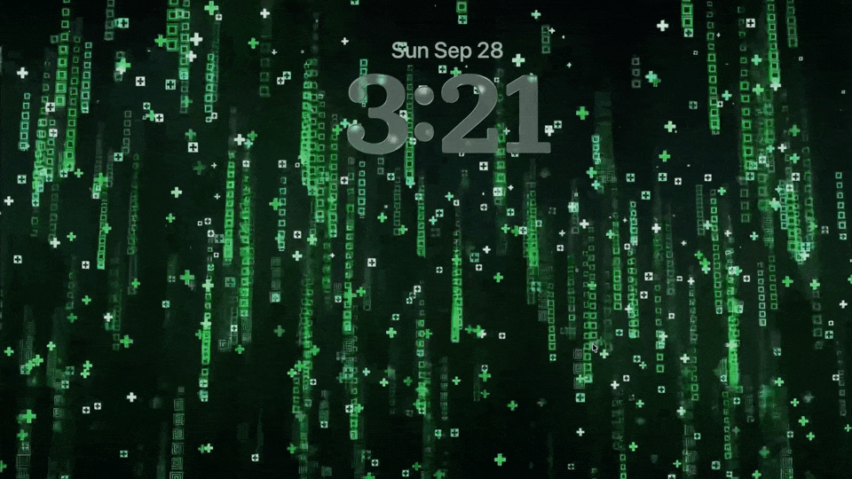

<!--idoc:ignore:start-->
> [!TIP]
> Declaration: This project is not an open-source project. The repository serves as the official website, used to collect issues and user demands. This is done to save costs, because without an official website, the application cannot pass the review.
<!--idoc:ignore:end-->

   
   
  
  <h1>
    Vidwall Hub
  </h1>
  <!--rehype:style=border: 0;-->
  

    <a href="./README.zh.md">简体中文</a> • 
    <a href="https://wangchujiang.com/vidwall/" target="_blank">Vidwall</a> • 
    <a target="_blank" href="https://github.com/jaywcjlove/vidwall-hub/issues/new?template=bug_report.yml">Contact & Support</a> • 
    <a href="./CHANGELOG.md">Changelog</a>
  

  

    
  

**Vidwall Hub** is a tool that allows you to easily import videos (`mp4`, `mov`) into the system wallpaper service and use them as lock screen animations in **System Settings**.

Due to sandbox restrictions, [Vidwall](https://github.com/jaywcjlove/vidwall) cannot directly implement this feature within the app. As a complement to [Vidwall](https://github.com/jaywcjlove/vidwall), Vidwall Hub also cannot directly set lock screen animations because macOS does not provide a related API. It only imports videos into the system wallpaper service, and users must complete the final setup in the wallpaper options of System Settings.