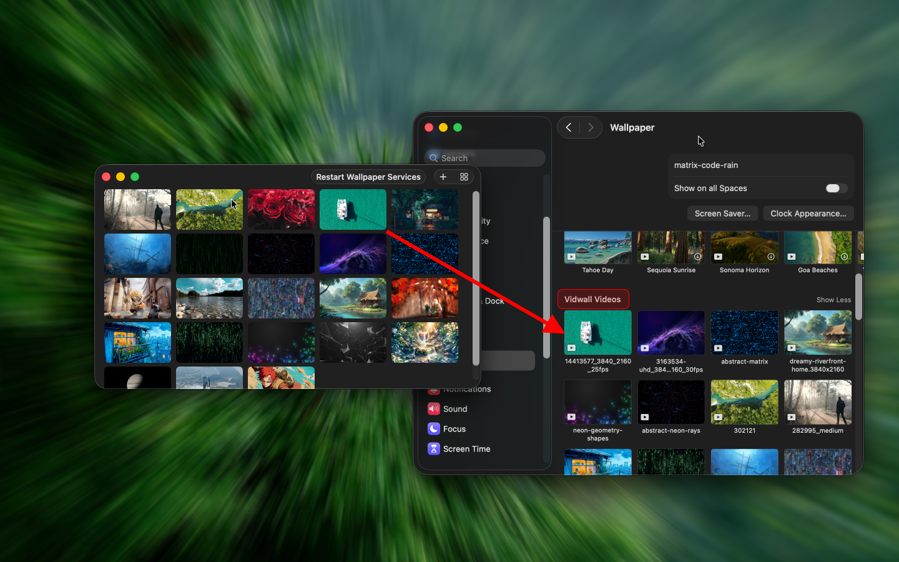

<!--idoc:ignore:start-->
> [!TIP]
> 声明：此项目并非开源项目，仓库作为官方网站，用于收集问题和用户需求。这样做是为了节省成本，因为没有官网，应用无法通过审核。
<!--idoc:ignore:end-->

   
   
  
  <h1>
    Vidwall Hub
  </h1>
  <!--rehype:style=border: 0;-->
  

    <a href="./README.md">English</a> • 
    <a href="https://wangchujiang.com/vidwall/" target="_blank">Vidwall</a> • 
    <a target="_blank" href="https://github.com/jaywcjlove/vidwall-hub/issues/new?template=bug_report_cn.yml">联系&支持</a> • 
    <a href="./CHANGELOG.zh.md">更新日志</a>
  

  

    
  

**Vidwall Hub** 是一款可以轻松将视频（`mp4`、`mov`）导入系统壁纸服务，并在 `系统设置` 中用作锁屏动画的工具。

在尝试通过 [Vidwall](https://github.com/jaywcjlove/vidwall) 应用同时实现动态壁纸和动态锁屏功能时，由于 macOS 沙盒限制，这一功能无法实现。因此，我将测试后的代码独立成一个新应用 免费提供给大家使用，作为 [Vidwall](https://github.com/jaywcjlove/vidwall) 的补充。即使独立运行、绕过沙盒限制，仍无法直接设置动态锁屏，因为 macOS 并未提供相关 API。Vidwall Hub 仅将视频导入系统壁纸服务，用户需要在系统设置的壁纸选项中完成最终应用。

<!--idoc:config:
title: Vidwall Hub
keywords: Vidwall Hub,视频壁纸,锁屏动画,macOS 工具,系统效率
description: Vidwall Hub 是一款可以轻松将视频（mp4、mov）导入系统壁纸服务，并在系统设置中将其用作锁屏动画的工具。
-->